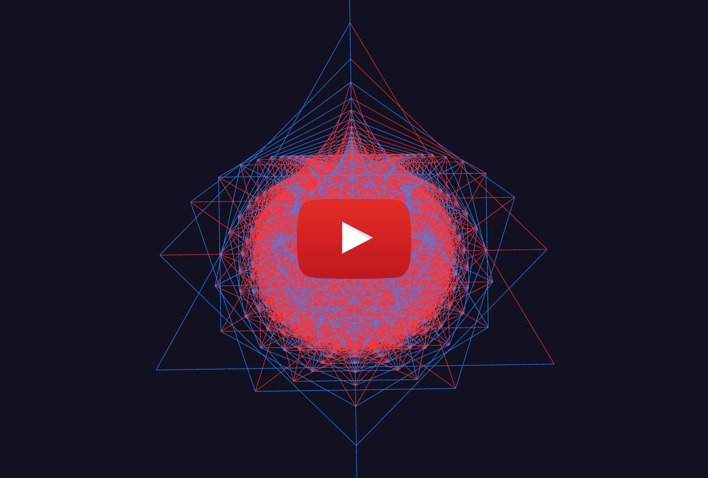

# Ramsey-Crystals

### Summary

By applying a [generalized Scale Space Theory](https://en.wikipedia.org/wiki/Scale_space) to Ramsey numbers, we can treat each layer like a [coarse graining](https://en.wikipedia.org/wiki/Coarse-grained_modeling) and stack them to see the cross-scale structure. Looking at it from below (lowest number), a complex, symmetrical shape becomes visible.

### Video

### Live Demo

<a href="https://codepen.io/your-work" target="blank">Codepen Demo available here</a>

### Primes

### Non-Primes

### Combined

### For More

Please come subscribe to [/r/ScaleSpace](https://reddit.com/r/ScaleSpace)

### Message Me

[DM me on reddit](https://reddit.com/u/solidwhetstone)

